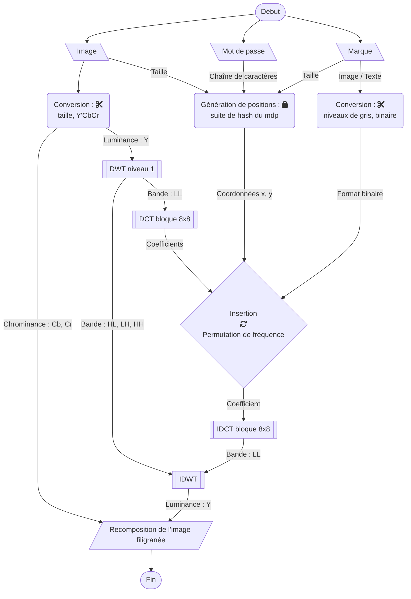
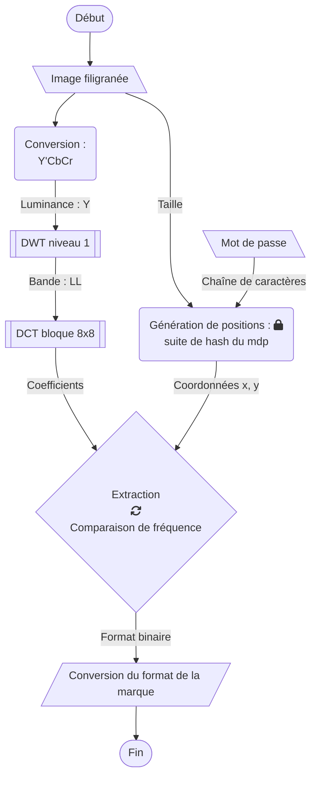
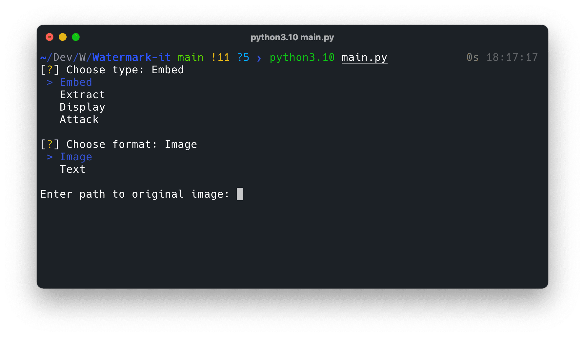
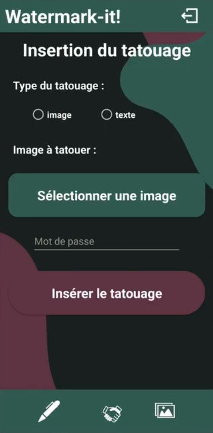
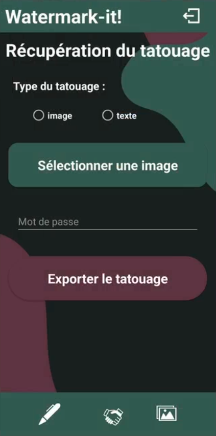
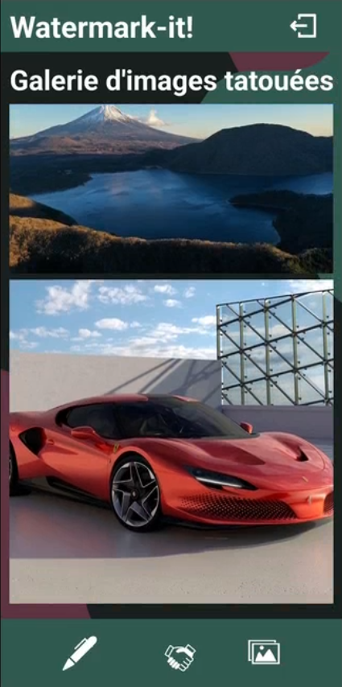
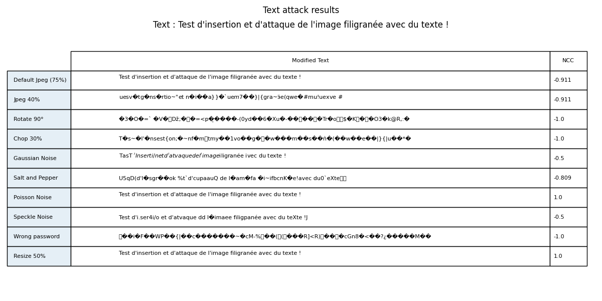

# Watermark-it


## Fonctionnalités

### Point fort
- Imperceptible (PSNR >= 35dB)
- Couleur de l'image principale conservée
- Taille de l'image principale conservée (à 7x7 pixels près)
- Placement de la marque pseudo-aléatoire (avec un mot de passe)
- Extraction aveugle
- Robustesse aux attaques (compression, bruit, redimensionnement ± 2)
- Conversion automatique des images (taille, couleur, format binaire)
- Taille de la marque ajustée automatiquement ((1/16)/1,3 de l'image)
- Marque format texte ou image

### Limites
- Format d'image compatible : PNG, (GIF), JPG, (TIFF), BMP
- Faible espace de stockage (1/16 de l'image max)
- Non robuste aux attaques (rotation, déformation)


## Fonctionnement

Organigramme :

Insertion de la marque dans l'image


Extraction de la marque de l'image


(1/16)/1,3 de l'image : Pour calculer plus rapidement les positions
Conversion de l'image au multiple de 8 inférieurs le plus proche : Pour l'utilisation de la DCT sur les blocs de 8x8 pixels


### Méthode d'insertion

La méthode utilisée est celle du basculement de fréquence (Frequency-Flipping). Appliqué aux coefficients obtenus par la DCT des blocs de 8x8 pixel de l'image (matrice de normalisation DCT). L'idée est d'inverser 2 des coefficients de chaque bloc s'il ne respecte pas la règle suivante :

$$\begin{aligned}
& C1 >\quad C2 \longrightarrow 0 \\
& C1 <= C2 \longrightarrow 1
\end{aligned}$$

(avec C1 et C2 les coefficients à comparer et 0 et 1 les valeurs à attribuer correspondant à la marque en binaire)

L'emplacement des deux coefficients DCT devraient avoir une valeur moyenne comparable pour la matrice de normalisation DCT 8x8. (ex : (4, 1) et (2, 3))


### Exemple de calcul de la taille de la marque

Pour une image de 2048x2048 pixels :
1) DWT niveau 1 : donne 4 sous bandes (LL, LH, HL, HH) de 1024x1024 pixels
2) DCT bloque 8x8 sur la bande LL : donne 128x128 blocs de 8x8 pixels
3) Méthode de permutation de fréquence : insertion de 1 bit par bloc soit 16384 bit total (1/16 de l'image)
La marque peut donc avoir une taille maximum de 128x128 pixels pour une image ou 2048 lettres pour un texte.

Afin d'accélérer le calcul des positions, on divise la taille de la marque par 1,3 par rapport à la taille maximum d'insertion. (ex : 128x128 pixels / 1,3 = 98x98 pixels)

- [ ] Modification possible de la méthode d'insertion pour augmenter le nombre de bit à insérer par bloc.


## Exemple d'utilisation

### Interface graphique 
(Gui : Tkinter)
Fichier `watermark_it.py`


### En ligne de commande
(Interactive : inquirer)
Fichier `main.py`


### Avec Python
#### Watermarking avec une image
Fichier `watermark.py`
```python
watermarkeImage = embeddedImage(image,marque, password) 
watermarkeImage.save(result)

watermarkArray = recoverWatermark(result, password) # Wsize=(x, y) for specific mark
watermarkArray.save('result/recoveredWatermark.png')
```

##### Affichage des images et comparaison
Fichier `display.py`
```python
plotResult(image, marque, Iresult, Mresult, x)

plotDiff(image, marque, Iresult, Mresult, x) 
```
##### Attaque de l'image watermarkée
Fichier `attack.py`
```python
# Vue groupée
attackAll(image, marque, Iresult, Mresult, x, password)
# Vue individuelle
attackOne(image, marque, Iresult, Mresult, x, password)
```

#### Watermarking avec du texte
Fichier `watermark.py`
```python
watermarkeImage = embeddedTexte(image,texte, password)
watermarkeImage.save(result)

watermarkArray = recoverText(result, password)
print(watermarkArray)
```

### Sur Android
Intégration dans l'application Android : [Watermarker](https://github.com/Skelrin/Watermarker)


| Login                                          | Insertion                                          | Extraction                                       | Gallery                                   |
| ---------------------------------------------- | -------------------------------------------------- | ------------------------------------------------ | ----------------------------------------- |
|  |  |  |  |


## Résultats

Différences


Robustesse / Attaques


PSNR : peak signal to noise ratio, utilisé pour mesurer l'image après l'ajout du filigrane, plus le nombre est grand mieux c'est. Au-dessus de 35, il est difficile de voir la différence à l'œil nu.

NCC : normalized cross correlation, utilisé pour mesurer la corrélation entre la marque d'origine et après extraction, plus le nombre est grand mieux c'est. (entre 0 et 1)



### Archive

Ordre d'avancement des fichiers : 

Image Watermarking.ipynb
- Arnold
- Colors
- Texte
- YCbCr
- Key
- Flipping
- Optimisation
- Position
- Size


---

Référence : 
[Image-watermarking-using-DCT](https://github.com/voilentKiller0/Image-watermarking-using-DCT)

Intéréssant :
[blind_watermark](https://github.com/guofei9987/blind_watermark) (best ?),
[DWT-and-DCT-watermarking](https://github.com/ChanonTonmai/DWT-and-DCT-watermarking) (non robuste),
[DCT-DWT-SVD-Digital-Watermarking](https://github.com/cyanaryan/DCT-DWT-SVD-Digital-Watermarking) (non aveugle),
[image_watermarking](https://github.com/lakshitadodeja/image_watermarking) (ex for dwt, dct, dft,svd and dwt-svd),
[digital-watermarking](https://github.com/hieunguyen1053/digital-watermarking) (choix des actions)
